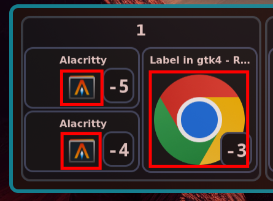
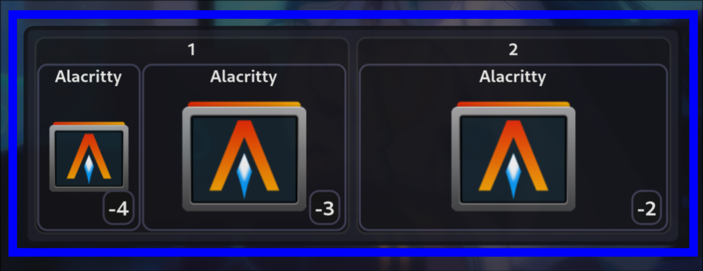

# CSS

### Class used in GUI + default css:

- **client-image**
  <table><tr><td>

  ```css
  .client-image {
    margin: 10px;
  }
  ```
  </td><td> </td></tr></table>

- **client** + **client_active**

  client_active is the client that is currently focused / will be focused when exiting hyprswitch
  <table><tr><td>

  ```css
  .client {
    font-size: 16px;
    font-weight: normal;

    border-radius: var(--border-radius);
    background-color: var(--bg-color);
    border: 3px solid var(--border-color);
  }
  .client:hover {
    background-color: var(--bg-color-hover);
  }
  .client_active {
    border: 3px solid var(--border-color-active);
  }
  ```
  </td><td> </td></tr></table>

- **workspace_frame** + **workspace_frame_special** + **workspace_active**

  workspace_frame_special is added when workspaceId is < 0 (e.g., scratchpad)
  <table><tr><td>

  ```css
  .workspace {
    font-size: 24px;
    font-weight: bold;

    border-radius: var(--border-radius);
    background-color: var(--bg-color);
    border: 3px solid var(--border-color);
  }
  .workspace:hover {
    background-color: var(--bg-color-hover);
  }
  .workspace_active {
    border: 3px solid var(--border-color-active);
  }
  .workspace_special {
    border: 3px solid rgba(0, 255, 0, 0.4);
  }
  ```
  </td><td> </td></tr></table>

- **monitor** + **monitor_active**
  <table><tr><td>

  ```css
  .monitor {
    opacity: 0.75;
    padding: 2px;

    border-radius: var(--border-radius);
    background-color: var(--bg-color);
    border: 4px solid var(--border-color);
  }
  .monitor:hover {
    background-color: var(--bg-color-hover);
  }
  .monitor_active {
    border: 3px solid var(--border-color-active);
  }
  ```
  </td><td> </td></tr></table>

- **index**
  <table><tr><td>

  ```css
  .index {
    margin: 3px;
    padding: 2px 4px;
    font-size: 18px;
    font-weight: bold;
    font-family: monospace;
    border-radius: var(--border-radius);
    background-color: var(--bg-color);
    border: 3px solid var(--index-border-color);
  }
  ```
  </td><td> </td></tr></table>

### [Default CSS](src/daemon/gui/css.rs)

```css
* {
  border: unset;
}

window {
    --border-color: rgba(90, 90, 110, 0.4);
    --border-color-active: rgba(239, 9, 9, 0.9);
    --bg-color: rgba(20, 20, 20, 1);
    --bg-color-hover: rgba(40, 40, 50, 1);
    --index-border-color: rgba(20, 170, 170, 0.7);
    --border-radius: 12px;
}

.client-image {
    margin: 10px;
}

.client {
    font-size: 16px;
    font-weight: normal;

    border-radius: var(--border-radius);
    background-color: var(--bg-color);
    border: 3px solid var(--border-color);
}

.client:hover {
    background-color: var(--bg-color-hover);
}

.client_active {
    border: 3px solid var(--border-color-active);
}


.workspace {
    font-size: 24px;
    font-weight: bold;

    border-radius: var(--border-radius);
    background-color: var(--bg-color);
    border: 3px solid var(--border-color);
}

.workspace:hover {
    background-color: var(--bg-color-hover);
}

.workspace_special {
    border: 3px solid rgba(0, 255, 0, 0.4);
}

.workspace_active {
    border: 3px solid var(--border-color-active);
}


.monitor {
    opacity: 0.75;
    padding: 2px;

    border-radius: var(--border-radius);
    background-color: var(--bg-color);
    border: 4px solid var(--border-color);
}

.monitor:hover {
    background-color: var(--bg-color-hover);
}

.window_active {
    border: 3px solid var(--border-color-active);
}


.index {
    margin: 3px;
    padding: 2px 4px;
    font-size: 18px;
    font-weight: bold;
    font-family: monospace;
    border-radius: var(--border-radius);
    background-color: var(--bg-color);
    border: 3px solid var(--index-border-color);
}
```

### Examples:

**High Res**: Use for high resolution monitors (increase font size, margins, etc.)

```css
window {
    --border-radius: 15px;
}

.client-image {
    margin: 15px;
}

.index {
    margin: 10px;
    font-size: 25px;
}

.workspace {
    font-size: 35px;
}

.client {
    font-size: 25px;
}
```

**Blue**: Use blue as the border and active border color

```css
window {
    --border-color: rgba(2, 63, 63, 0.4);
    --border-color-active: rgba(17, 170, 217, 0.9);
    --border-radius: 12px;
    --index-border-color: rgba(17, 170, 217, 0.7);
}
```

**Only clients**: Don't show the workspace and monitor frames (use with `--max-switch-offset=0`)

```css
.workspace {
    /* remove workspace name */
    font-size: 0;
    font-weight: lighter;

    background-color: transparent;
    border: unset;
}

.monitor {
    background-color: transparent;
    border: unset;
}
```