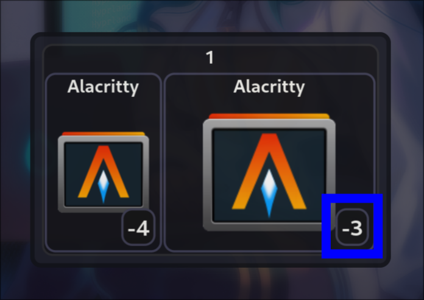
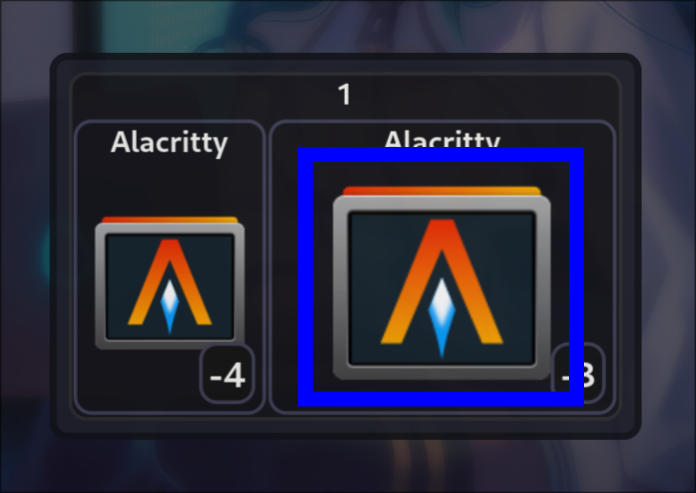
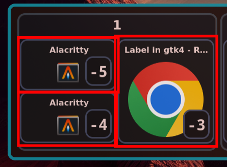
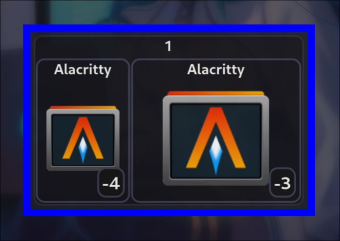
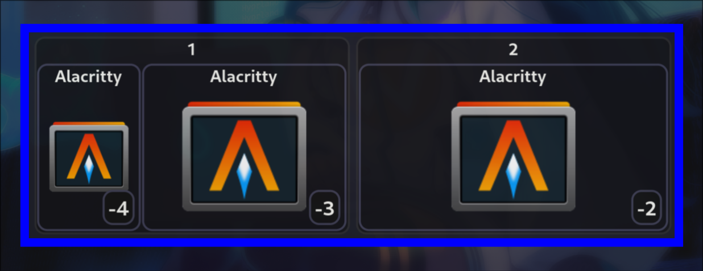
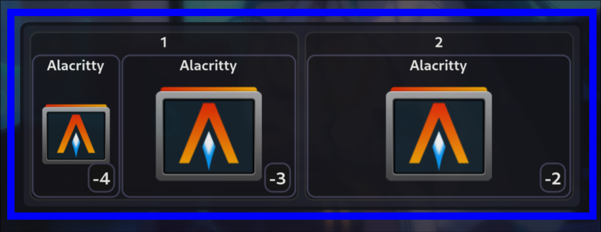

# hyprswitch

[](https://crates.io/crates/hyprswitch)
[](https://docs.rs/hyprswitch)
[](https://github.com/h3rmt/hyprswitch/actions/workflows/rust.yml)

A rust CLI/GUI to switch between windows in [Hyprland](https://github.com/hyprwm/Hyprland)

It can cycle through windows using keyboard shortcuts or/and a GUI.

Windows are sorted by their position on the screen, and can be filtered by class or workspace.

To use the GUI, you need to start the daemon once at the start of Hyprland with `exec-once = hyprswitch init &` in your
config.
Subsequent calls to hyprswitch (with the `gui` command) will send the command to the daemon which will execute the
command and update the GUI.


# Installation

### From Source

- gtk4 and [gtk4-layer-shell](https://github.com/wmww/gtk4-layer-shell) must be installed
- `cargo install hyprswitch`

### Arch

- `paru -S hyprswitch` / `yay -S hyprswitch`

### Nixos

- add ``hyprswitch.url = "github:h3rmt/hyprswitch/release";`` to flake inputs
- add `specialArgs = { inherit inputs; };` to `nixpkgs.lib.nixosSystem`
- add `inputs.hyprswitch.packages.x86_64-linux.default` to your `environment.systemPackages`
- available systems: `aarch64-linux`, `i686-linux`, `riscv32-linux`, `riscv64-linux`, `x86_64-linux`

# Usage

Once the binary is installed, you can modify your `~/.config/hypr/hyprland.conf`.

## Parameters

- `--dry-run / -d` Print the command that would be executed
- `-v` Increase the verbosity level (max: -vv)

- `init` Initialize and start the Daemon
    - `--custom-css <PATH>` Specify a path to custom css file
    - `--show-title` Show the window title in the GUI (fallback to class if title is empty)

- `gui` Starts/Opens the GUI + sends the command to daemon of GUI is already opened
    - `--mod-key <MODIFIER>` The modifier key to used to open the GUI (super_l, super_r, alt_l, alt_r, ctrl_l, ctrl_r,
      shift_l, shift_r)
    - `--key <KEY>` The key to used to open the GUI (e.g., tab)
    - `--reverse-key <KEYTYPE>=<KEY>` The key used for reverse switching. Format: reverse-key=mod=<MODIFIER> or
      reverse-key=key=<KEY> (e.g., --reverse-key=mod=shift, --reverse-key=key=grave)
    - `--close <TYPE>` How to close hyprswitch
        - `mod-key-index` Close when pressing the mod key + key again (e.g., SUPER + TAB) or an index key (1, 2,
          3, ...) or clicking on a window in GUI (or pressing escape)
        - `index` Close when pressing an index key (1, 2, 3, ...) or clicking on a window in GUI (or pressing
          escape)
        - `mod-key` Close when pressing the mod key + key again (e.g., SUPER + TAB) or clicking on a window in
          GUI (or pressing escape)
        - `mod-key-release` Close when releasing the mod key (e.g., SUPER) or clicking on a window in GUI (or pressing
          escape)
        - `none` Close when clicking on a window in GUI (or pressing escape)
    - `--max-switch-offset <MAX_SWITCH_OFFSET>` The maximum offset you can switch to with number keys and is shown in
      the GUI
    - Same options as `simple` except `--offset` and `--reverse`

- `simple` Switch without using the GUI / Daemon (switches directly)
    - `--reverse / -r` Reverse the order of windows / switch backwards
    - `--offset / -o <OFFSET>` Switch to a specific window offset (default 1)
    - `--include-special-workspaces` Include special workspaces (e.g., scratchpad)
    - `--ignore-workspaces` Sort all windows on every monitor like [one contiguous workspace](#--ignore-workspaces)
    - `--ignore-monitors` Sort all windows on matching workspaces on monitors like [one big monitor](#--ignore-monitors)
    - `--filter-same-class / -s` Only switch between windows that have the same class/type as the currently focused
      window
    - `--filter-current-workspace / -w` Only switch between windows that are on the same workspace as the currently
      focused window
    - `--filter-current-monitor / -m` Only switch between windows that are on the same monitor as the currently focused
      window
    - `--sort-recent` Sort windows by most recently focused
    - `--switch-workspaces` Switches to next / previous workspace instead of client

- `dispatch` Used to send commands to the daemon (used in keymap that gets generated by gui)
    - `--reverse / -r` Reverse the order of windows / switch backwards
    - `--offset / -o <OFFSET>` Switch to a specific window offset (default 1)

- `close` Close the GUI, executes the command to switch window
    - `--kill` Don't switch to the selected window, just close the GUI

## Examples:

(Modify the $... variables to use the keys you prefer)

### No GUI

**Next/Previous**

```ini
# 2 Keybindings to switch to 'next' or 'previous' window
$key = tab
bind = ctrl, $key, exec, hyprswitch simple
bind = ctrl shift, $key, exec, hyprswitch simple -r
```

**Last Focused**

```ini
# 1 Keybinding to switch to previously focused application
$key = tab
bind = ctrl, $key, exec, hyprswitch simple --sort-recent
```

**Same class(type)**

```ini
# 2 Keybindings to switch to next' or 'previous' window of same class/type
$key = tab
bind = ctrl, $key, exec, hyprswitch simple -s
bind = ctrl shift, $key, exec, hyprswitch simple -s -r
```

### GUI

**Simple**: Press super + $key to open the GUI, use mouse to click on window

```ini
exec-once = hyprswitch init --show-title &

$key = tab
bind = super, $key, exec, $bin gui --mod-key super_l --key $key
```

**Keyboard**: Press alt + $key to open the GUI, hold alt, press $key to switch to the next window, press shift + $key to
switch backwards, release alt to switch

```ini
exec-once = hyprswitch init --show-title &

$key = tab
bind = alt, $key, exec, hyprswitch gui --mod-key alt_l --key $key --close mod-key-release && hyprswitch dispatch
bind = alt shift, $key, exec, hyprswitch gui --mod-key alt_l --key $key --close mod-key-release && hyprswitch dispatch -r

# use the if switching to the next window with the opening keypress is unwanted
#bind = alt, $key, exec, hyprswitch gui --mod-key alt_l --key $key --close mod-key-release
#bind = alt shift, $key, exec, hyprswitch gui --mod-key alt_l --key $key --close mod-key-release
```

# CSS

### Class used in GUI + default css:

- **client-image**
  <table><tr><td>

  ```css
  .client-image {
    margin: 15px;
  }
  ```
  </td><td> </td></tr></table>

- **index**
  <table><tr><td>

  ```css
  .client-index {
    margin: 6px;
    padding: 5px;
    font-size: 30px;
    font-weight: bold;
    border-radius: 15px;
    border: 3px solid rgba(80, 90, 120, 0.80);
    background-color: rgba(20, 20, 20, 1);
  }
  ```
  </td><td> </td></tr></table>

- **client** + **client_active**

  client_active is the client that is currently focused / will be focused when exiting hyprswitch
  <table><tr><td>

  ```css
  .client {
    border-radius: 15px;
    border: 3px solid rgba(80, 90, 120, 0.80);
    background-color: rgba(25, 25, 25, 0.90);
  }
  .client:hover {
    background-color: rgba(40, 40, 50, 1);
  }
  .client_active {
    border: 3px solid rgba(239, 9, 9, 0.94);
  }
  ```
  </td><td> </td></tr></table>

- **workspace_frame** + **workspace_frame_special** + **workspace_active**

  workspace_frame_special is added when workspaceId is < 0 (e.g., scratchpad)
  <table><tr><td>

  ```css
  .workspace {
    font-size: 25px;
    font-weight: bold;
    border-radius: 15px;
    border: 3px solid rgba(70, 80, 90, 0.80);
    background-color: rgba(20, 20, 25, 0.90);
  }
  .workspace:hover {
    background-color: rgba(40, 40, 50, 1);
  }
  .workspace_special {
    border: 3px solid rgba(0, 255, 0, 0.4);
  }
  .workspace_active {
    border: 3px solid rgba(239, 9, 9, 0.94);
  }
  ```
  </td><td> </td></tr></table>

- **workspaces (use experimental WORKSPACES_PER_ROW env var to change width)**
  <table><tr><td>

  ```css
  .workspaces {
    margin: 10px;
  }
  ```
  </td><td> </td></tr></table>

- **window**
  <table><tr><td>

  ```css
  window {
    border-radius: 15px;
    opacity: 0.85;
    border: 6px solid rgba(15, 170, 190, 0.85);
  }
  ```
  </td><td> </td></tr></table>

### Default CSS:

```css
.client-image {
    margin: 15px;
}

.client {
    border-radius: 15px;
    border: 3px solid rgba(80, 90, 120, 0.80);
    background-color: rgba(25, 25, 25, 0.90);
}

.client:hover {
    background-color: rgba(40, 40, 50, 1);
}

.client_active {
    border: 3px solid rgba(239, 9, 9, 0.94);
}

.workspace {
    font-size: 25px;
    font-weight: bold;
    border-radius: 15px;
    border: 3px solid rgba(70, 80, 90, 0.80);
    background-color: rgba(20, 20, 25, 0.90);
}

.workspace:hover {
    background-color: rgba(40, 40, 50, 1);
}

.workspace_special {
    border: 3px solid rgba(0, 255, 0, 0.4);
}

.workspace_active {
    border: 3px solid rgba(239, 9, 9, 0.94);
}

.index {
    margin: 6px;
    padding: 5px;
    font-size: 30px;
    font-weight: bold;
    border-radius: 15px;
    border: 3px solid rgba(80, 90, 120, 0.80);
    background-color: rgba(20, 20, 20, 1);
}

.workspaces {
    margin: 10px;
}

window {
    border-radius: 15px;
    opacity: 0.85;
    border: 6px solid rgba(15, 170, 190, 0.85);
}
```

### Custom CSS Example to override default CSS values:

```css
.client_active {
    border: 3px solid rgba(239, 9, 9, 0.94);
    background-color: rgba(200, 9, 9, 0.80);
}

.client-image {
    margin: 10px;
}

window {
    opacity: 1;
    border: 6px solid rgba(0, 0, 0, 0.85);
}
```

# Other

### Sorting of windows

See [tests](/tests) for more details on how windows get sorted

```
   1      2  3      4
1  +------+  +------+
2  |  1   |  |  2   |
3  |      |  +------+
4  +------+  +------+
5  +------+  |  4   |
6  |  3   |  |      |
7  +------+  +------+
   1      2  3      4
```

```
                  Monitor 1
      Workspace 1           Workspace 2
1  +------+  +------+ | +------+  +------+
2  |  1   |  |  2   |   |  5   |  |  6   |
3  |      |  |      | | |      |  +------+
4  +------+  +------+   +------+  +------+
5  +------+  +------+ | +------+  |  8   |
6  |  3   |  |  4   |   |  7   |  |      |
7  +------+  +------+ | +------+  +------+
   1      2  3      4   1      2  3      4
```

```
      1       3    5   6     8   10  11  12
   +----------------------------------------+
1  |  +-------+                      +---+  |
2  |  |   1   |              +---+   | 5 |  |
3  |  |       |    +---+     | 3 |   |   |  |
4  |  +-------+    | 2 |     +---+   |   |  |
5  |               +---+     +---+   |   |  |
6  |                         | 4 |   |   |  |
7  |    +-------+            +---+   +---+  |
8  |    |   6   |         +----+            |
9  |    |       |         | 7  |            |
10 |    +-------+         +----+            |
   +----------------------------------------+
        2       4         7    9
```

### `--ignore-workspaces`

- Order without `--ignore-workspaces`

```
                   Monitor 1                                   Monitor 2
       Workspace 0           Workspace 1           Workspace 10          Workspace 11
 1  +------+  +------+ | +------+  +------+  |  +------+  +------+ | +------+  +------+
 2  |  1   |  |  2   | | |  5   |  |  6   |  |  |  9   |  |  10  | | |  13  |  |  14  |
 3  |      |  |      | | |      |  +------+  |  |      |  |      | | |      |  +------+
 4  +------+  +------+ | +------+  +------+  |  +------+  +------+ | +------+  +------+
 5  +------+  +------+ | +------+  |  8   |  |  +---------+  +---+ | +------+  |  16  |
 6  |  3   |  |  4   | | |  7   |  |      |  |  |   11    |  |12 | | |  15  |  |      |
 7  +------+  +------+ | +------+  +------+  |  +---------+  +---+ | +------+  +------+
    1      2  3      4   1      2  3      4     5      6  7  8   9   5      6  7   8  9
```

- Order with `--ignore-workspaces`

```
                   Monitor 1                                   Monitor 2
       Workspace 0           Workspace 1           Workspace 10         Workspace 11
 1  +------+  +------+ | +------+  +------+  |  +------+  +------+ | +------+  +------+
 2  |  1   |  |  2   | | |  3   |  |  4   |  |  |  9   |  |  10  | | |  11  |  |  12  |
 3  |      |  |      | | |      |  +------+  |  |      |  |      | | |      |  +------+
 4  +------+  +------+ | +------+  +------+  |  +------+  +------+ | +------+  +------+
 5  +------+  +------+ | +------+  |  8   |  |  +---------+  +---+ | +------+  |  16  |
 6  |  5   |  |  6   | | |  7   |  |      |  |  |   13    |  |14 | | |  15  |  |      |
 7  +------+  +------+ | +------+  +------+  |  +---------+  +---+ | +------+  +------+
    1      2  3      4   1      2  3      4     5      6  7  8   9   5      6  7   8  9
```

### `--ignore-monitors`

- Order without `--ignore-monitors`

```
                   Monitor 1                                   Monitor 2
       Workspace 0           Workspace 1           Workspace 10          Workspace 11
 1  +------+  +------+ | +------+  +------+  |  +------+  +------+ | +------+  +------+
 2  |  1   |  |  2   | | |  5   |  |  6   |  |  |  9   |  |  10  | | |  13  |  |  14  |
 3  |      |  |      | | |      |  +------+  |  |      |  |      | | |      |  +------+
 4  +------+  +------+ | +------+  +------+  |  +------+  +------+ | +------+  +------+
 5  +------+  +------+ | +------+  |  8   |  |  +---------+  +---+ | +------+  |  16  |
 6  |  3   |  |  4   | | |  7   |  |      |  |  |   11    |  |12 | | |  15  |  |      |
 7  +------+  +------+ | +------+  +------+  |  +---------+  +---+ | +------+  +------+
    1      2  3      4   1      2  3      4     5      6  7  8   9   5      6  7   8  9
```

- Order with `--ignore-monitors`

```
                   Monitor 1                                   Monitor 2
       Workspace 0           Workspace 1           Workspace 10          Workspace 11
 1  +------+  +------+ | +------+  +------+  |  +------+  +------+ | +------+  +------+
 2  |  1   |  |  2   | | |  9   |  |  10  |  |  |  3   |  |  4   | | |  11  |  |  12  |
 3  |      |  |      | | |      |  +------+  |  |      |  |      | | |      |  +------+
 4  +------+  +------+ | +------+  +------+  |  +------+  +------+ | +------+  +------+
 5  +------+  +------+ | +------+  |  14  |  |  +---------+  +---+ | +------+  |  16  |
 6  |  5   |  |  6   | | |  13  |  |      |  |  |   7     |  | 8 | | |  15  |  |      |
 7  +------+  +------+ | +------+  +------+  |  +---------+  +---+ | +------+  +------+
    1      2  3      4   1      2  3      4     5      6  7  8   9   5      6  7  8   9
```

### Experimental Environment Variables

- `SIZE_FACTOR` i16 [default: 7]: Factor window and workspace size get divided by to shrink them
- `ICON_SIZE` i32 [default: 128]: Argument passed to the theme.lookup_icon function (Determines the resolution of the
  Icon, as it gets scaled to the windowsize regardless of the resolution of the icon)
- `ICON_SCALE` i32 [default: 1]: Argument passed to the theme.lookup_icon function (IDK what this does, setting it to
  anything other than 1 changes nothing)
- `WORKSPACES_PER_ROW` u32 [default: 5]: Number of workspaces per row in the GUI
