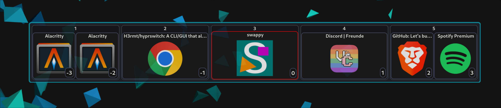

# hyprswitch

[](https://crates.io/crates/hyprswitch)
[](https://docs.rs/hyprswitch)
[](https://github.com/h3rmt/hyprswitch/actions/workflows/rust.yml)

A rust CLI/GUI to switch between windows in [Hyprland](https://github.com/hyprwm/Hyprland)

It can cycle through windows using keyboard shortcuts or/and a GUI.

Windows are sorted by their position on the screen, and can be filtered by class or workspace.

To use the GUI, you need to start the daemon once at the start of Hyprland with `exec-once = hyprswitch init &` in your
config.
Subsequent calls to hyprswitch (with the `gui` command) will send the command to the daemon which will execute the
command and update the GUI.



Table of Contents
=================

* [Migration to 3.0.0](#migration-to-300)
* [Installation](#installation-hyprland--042-required)
    * [From Source](#from-source)
    * [Arch](#arch)
    * [Nixos](#nixos)
* [Usage](#usage)
    * [Parameters](#parameters-see-hyprswitch---help--hyprswitch-init---help---for-more-detailed-info)
    * [Examples](./EXAMPLES.md)
* [Theming](#theming---custom-css)
* [Other](#other)
    * [Sorting of windows](#sorting-of-windows)
    * [--ignore-workspaces](#--ignore-workspaces)
    * [--ignore-monitors](#--ignore-monitors)
    * [Experimental Environment Variables](#experimental-environment-variables)

# Migration to 3.0.0

1. The complex Config has been removed in favor of a simpler config.
2. More GUI - CLI options added. (`--mod-key` / `--switch-type` / ...)
3. Removed some cli args. (`--do-initial-execute`, `--stay-open-on-close`)

### See [Migration.md](MIGRATION.md) for more details

# Installation (Hyprland >= 0.42 required)

### From Source

- gtk4 and [gtk4-layer-shell](https://github.com/wmww/gtk4-layer-shell) must be installed
- `cargo install hyprswitch`

### Arch

- `paru -S hyprswitch` / `yay -S hyprswitch`

### Nixos

- add ``hyprswitch.url = "github:h3rmt/hyprswitch/release";`` to flake inputs
- add `specialArgs = { inherit inputs; };` to `nixpkgs.lib.nixosSystem`
- add `inputs.hyprswitch.packages.x86_64-linux.default` to your `environment.systemPackages`
- available systems: `aarch64-linux`, `i686-linux`, `riscv32-linux`, `riscv64-linux`, `x86_64-linux`

# Usage

Once the binary is installed, you can modify your `~/.config/hypr/hyprland.conf`.

## Parameters (see `hyprswitch --help` / `hyprswitch init --help` / ... for more detailed info)

- `--dry-run / -d` Print the command that would be executed instead of executing it
- `-v` Increase the verbosity level (-v: info, -vv: debug, -vvv: trace)

- `init` Initialize and start the Daemon
    - `--custom-css <PATH>` Specify a path to custom css file
    - `--show-title` Show the windows title instead of its class in Overview (fallback to class if title is empty)
    - `--workspaces-per-row` Limit amount of workspaces in one row (overflows to next row)
    - `--size-factor` The size factor (float) for the GUI (original_size / 30 * size_factor)
- `gui` Starts/Opens the GUI + sends the command to daemon of GUI is already opened
    - `--mod-key <MODIFIER>` The modifier key to used to open the GUI (super/super_l, super_r, alt/alt_l, alt_r, ctrl/ctrl_l, ctrl_r)
    - `--key <KEY>` The key to used to open the GUI (e.g., tab)
    - `--reverse-key <KEYTYPE>=<KEY>` The key used for reverse switching. Format: reverse-key=mod=<MODIFIER> or
      reverse-key=key=<KEY> (e.g., --reverse-key=mod=shift, --reverse-key=key=grave)
    - `--close <TYPE>` How to close hyprswitch
        - `mod-key-index` Close when pressing the mod key + key again (e.g., SUPER + TAB) or an index key (1, 2,
          3, ...) or clicking on a window in GUI (or pressing escape)
        - `index` Close when pressing an index key (1, 2, 3, ...) or clicking on a window in GUI (or pressing
          escape)
        - `mod-key` Close when pressing the mod key + key again (e.g., SUPER + TAB) or clicking on a window in
          GUI (or pressing escape)
        - `mod-key-release` Close when releasing the mod key (e.g., SUPER) or clicking on a window in GUI (or pressing
          escape)
        - `none` Close when clicking on a window in GUI (or pressing escape)
    - `--max-switch-offset <MAX_SWITCH_OFFSET>` The maximum offset you can switch to with number keys and is shown in
      the GUI
    - Same options as `simple` except `--offset` and `--reverse`

- `simple` Switch without using the GUI / Daemon (switches directly)
    - `--reverse / -r` Reverse the order of windows / switch backwards
    - `--offset / -o <OFFSET>` Switch to a specific window offset (default 1)

    - `--include-special-workspaces` Include special workspaces (e.g., scratchpad)
    - `--ignore-workspaces` Sort all windows on every monitor like [one contiguous workspace](#--ignore-workspaces)
    - `--ignore-monitors` Sort all windows on matching workspaces on monitors like [one big monitor](#--ignore-monitors)
    - `--filter-same-class / -s` Only switch between windows that have the same class/type as the currently focused
      window
    - `--filter-current-workspace / -w` Only switch between windows that are on the same workspace as the currently
      focused window
    - `--filter-current-monitor / -m` Only switch between windows that are on the same monitor as the currently focused
      window
    - `--sort-recent` Sort windows by most recently focused
    - `--switch-type` Switches to next / previous workspace / client / monitor [default: client]
        - `client` Switch to next / previous client
        - `workspace` Switch to next / previous workspace
        - `monitor` Switch to next / previous monitor

- `dispatch` Used to send commands to the daemon (used in keymap that gets generated by gui)
    - `--reverse / -r` Reverse the order of windows / switch backwards
    - `--offset / -o <OFFSET>` Switch to a specific window offset (default 1)

- `close` Close the GUI, executes the command to switch window
    - `--kill` Don't switch to the selected window, just close the GUI

## Examples:

(Modify the $... variables to use the keys you prefer)

### GUI

**Simple**: Press `super` + `$key(tab)` to open the GUI, use mouse to click on window or press `1` / `2` / ... to switch to index

```ini
exec-once = hyprswitch init --show-title --size-factor 5.5 --workspaces-per-row 5 &

$key = tab
bind = super, $key, exec, hyprswitch gui --mod-key super_l --key $key --max-switch-offset 9
```

**Keyboard (reverse = grave / \` )**: Press `alt` + `$key(tab)` to open the GUI _(and switch to next window)_, hold `alt`, press `$key(tab)` repeatedly to switch to the next window, press ``$reverse(`)`` to switch backwards, release alt to switch

```ini
exec-once = hyprswitch init --show-title &
$key = tab
$reverse = grave

bind = alt, $key, exec, hyprswitch gui --mod-key alt_l --key $key --close mod-key-release --reverse-key=mod=$reverse && hyprswitch dispatch
bind = alt $reverse, $key, exec, hyprswitch gui --mod-key alt_l --key $key --close mod-key-release --reverse-key=mod=$reverse && hyprswitch dispatch -r

# use the if switching to the next window with the opening keypress is unwanted
#bind = alt, $key, exec, hyprswitch gui --mod-key alt_l --key $key --close mod-key-release --reverse-key=mod=$reverse
#bind = alt $reverse, $key, exec, hyprswitch gui --mod-key alt_l --key $key --close mod-key-release --reverse-key=mod=$reverse
```

**Keyboard recent (reverse = grave / \` )**: Press `alt` + `$key(tab)` to open the GUI _(and switch to previously used window)_, hold `alt`, press `$key(tab)` repeatedly to switch to the less and less previously used window, press ``$reverse(`)`` to switch to more recent used windows, release alt to switch

```ini
exec-once = hyprswitch init --show-title &
$key = tab
$reverse = grave

bind = alt, $key, exec, hyprswitch gui --mod-key alt_l --key $key --close mod-key-release --reverse-key=mod=$reverse --sort-recent && hyprswitch dispatch
bind = alt $reverse, $key, exec, hyprswitch gui --mod-key alt_l --key $key --close mod-key-release --reverse-key=mod=$reverse --sort-recent && hyprswitch dispatch -r

# use the if switching to the next window with the opening keypress is unwanted
#bind = alt, $key, exec, hyprswitch gui --mod-key alt_l --key $key --close mod-key-release --reverse-key=mod=$reverse
#bind = alt $reverse, $key, exec, hyprswitch gui --mod-key alt_l --key $key --close mod-key-release --reverse-key=mod=$reverse
```

### More Examples in [Examples.md](./EXAMPLES.md)

# [Theming](./CSS.md) (`--custom-css`)

### CSS Variables

```css
window {
    --border-color:        rgba(90, 90,110, 0.4);
    --border-color-active: rgba(239, 9,  9, 0.9);
    --bg-color:            rgba(20, 20, 20, 1);
    --bg-color-hover:      rgba(40, 40, 50, 1);
    --index-border-color:  rgba(20,170,170,0.7);
    --border-radius:       12px;
}
```

### Custom CSS Example for 4K screen to override default CSS values:

```css
/* light blue borders for active, more transparent bg and more border-radius */
window {
    --border-color-active: rgba(17, 170, 217, 0.9);
    --bg-color: rgba(20, 20, 20, 0.8);
    --border-radius: 15px;
}

/* more margin around image for 4K screen */
.client-image {
    margin: 15px;
}

/* increased index for 4K screen */
.index {
    margin: 10px;
    font-size: 25px;
}

/* increased font size for 4K screen */
.workspace {
    font-size: 35px;
}

/* increased font size for 4K screen */
.client {
    font-size: 25px;
}
```

### See [CSS.md](./CSS.md) for more info

# Other

### Sorting of windows

See [tests](/src/handle/sort/tests) for more details on how windows get sorted

```
   1      2  3      4
1  +------+  +------+
2  |  1   |  |  2   |
3  |      |  +------+
4  +------+  +------+
5  +------+  |  4   |
6  |  3   |  |      |
7  +------+  +------+
   1      2  3      4
```

```
                  Monitor 1
      Workspace 1           Workspace 2
1  +------+  +------+ | +------+  +------+
2  |  1   |  |  2   |   |  5   |  |  6   |
3  |      |  |      | | |      |  +------+
4  +------+  +------+   +------+  +------+
5  +------+  +------+ | +------+  |  8   |
6  |  3   |  |  4   |   |  7   |  |      |
7  +------+  +------+ | +------+  +------+
   1      2  3      4   1      2  3      4
```

```
      1       3    5   6     8   10  11  12
   +----------------------------------------+
1  |  +-------+                      +---+  |
2  |  |   1   |              +---+   | 5 |  |
3  |  |       |    +---+     | 3 |   |   |  |
4  |  +-------+    | 2 |     +---+   |   |  |
5  |               +---+     +---+   |   |  |
6  |                         | 4 |   |   |  |
7  |    +-------+            +---+   +---+  |
8  |    |   6   |         +----+            |
9  |    |       |         | 7  |            |
10 |    +-------+         +----+            |
   +----------------------------------------+
        2       4         7    9
```

### `--ignore-workspaces`

- Order without `--ignore-workspaces`

```
                   Monitor 1                                   Monitor 2
       Workspace 0           Workspace 1           Workspace 10          Workspace 11
 1  +------+  +------+ | +------+  +------+  |  +------+  +------+ | +------+  +------+
 2  |  1   |  |  2   | | |  5   |  |  6   |  |  |  9   |  |  10  | | |  13  |  |  14  |
 3  |      |  |      | | |      |  +------+  |  |      |  |      | | |      |  +------+
 4  +------+  +------+ | +------+  +------+  |  +------+  +------+ | +------+  +------+
 5  +------+  +------+ | +------+  |  8   |  |  +---------+  +---+ | +------+  |  16  |
 6  |  3   |  |  4   | | |  7   |  |      |  |  |   11    |  |12 | | |  15  |  |      |
 7  +------+  +------+ | +------+  +------+  |  +---------+  +---+ | +------+  +------+
    1      2  3      4   1      2  3      4     5      6  7  8   9   5      6  7   8  9
```

- Order with `--ignore-workspaces`

```
                   Monitor 1                                   Monitor 2
       Workspace 0           Workspace 1           Workspace 10         Workspace 11
 1  +------+  +------+ | +------+  +------+  |  +------+  +------+ | +------+  +------+
 2  |  1   |  |  2   | | |  3   |  |  4   |  |  |  9   |  |  10  | | |  11  |  |  12  |
 3  |      |  |      | | |      |  +------+  |  |      |  |      | | |      |  +------+
 4  +------+  +------+ | +------+  +------+  |  +------+  +------+ | +------+  +------+
 5  +------+  +------+ | +------+  |  8   |  |  +---------+  +---+ | +------+  |  16  |
 6  |  5   |  |  6   | | |  7   |  |      |  |  |   13    |  |14 | | |  15  |  |      |
 7  +------+  +------+ | +------+  +------+  |  +---------+  +---+ | +------+  +------+
    1      2  3      4   1      2  3      4     5      6  7  8   9   5      6  7   8  9
```

### `--ignore-monitors`

- Order without `--ignore-monitors`

```
                   Monitor 1                                   Monitor 2
       Workspace 0           Workspace 1           Workspace 10          Workspace 11
 1  +------+  +------+ | +------+  +------+  |  +------+  +------+ | +------+  +------+
 2  |  1   |  |  2   | | |  5   |  |  6   |  |  |  9   |  |  10  | | |  13  |  |  14  |
 3  |      |  |      | | |      |  +------+  |  |      |  |      | | |      |  +------+
 4  +------+  +------+ | +------+  +------+  |  +------+  +------+ | +------+  +------+
 5  +------+  +------+ | +------+  |  8   |  |  +---------+  +---+ | +------+  |  16  |
 6  |  3   |  |  4   | | |  7   |  |      |  |  |   11    |  |12 | | |  15  |  |      |
 7  +------+  +------+ | +------+  +------+  |  +---------+  +---+ | +------+  +------+
    1      2  3      4   1      2  3      4     5      6  7  8   9   5      6  7   8  9
```

- Order with `--ignore-monitors`

```
                   Monitor 1                                   Monitor 2
       Workspace 0           Workspace 1           Workspace 10          Workspace 11
 1  +------+  +------+ | +------+  +------+  |  +------+  +------+ | +------+  +------+
 2  |  1   |  |  2   | | |  9   |  |  10  |  |  |  3   |  |  4   | | |  11  |  |  12  |
 3  |      |  |      | | |      |  +------+  |  |      |  |      | | |      |  +------+
 4  +------+  +------+ | +------+  +------+  |  +------+  +------+ | +------+  +------+
 5  +------+  +------+ | +------+  |  14  |  |  +---------+  +---+ | +------+  |  16  |
 6  |  5   |  |  6   | | |  13  |  |      |  |  |   7     |  | 8 | | |  15  |  |      |
 7  +------+  +------+ | +------+  +------+  |  +---------+  +---+ | +------+  +------+
    1      2  3      4   1      2  3      4     5      6  7  8   9   5      6  7  8   9
```

### Experimental Environment Variables

- `ICON_SIZE` i32 [default: 128]: Argument passed to the theme.lookup_icon function (Determines the resolution of the
  Icon, as it gets scaled to the windowsize regardless of the resolution of the icon)
- `ICON_SCALE` i32 [default: 1]: Argument passed to the theme.lookup_icon function (IDK what this does, setting it to
  anything other than 1 changes nothing)
